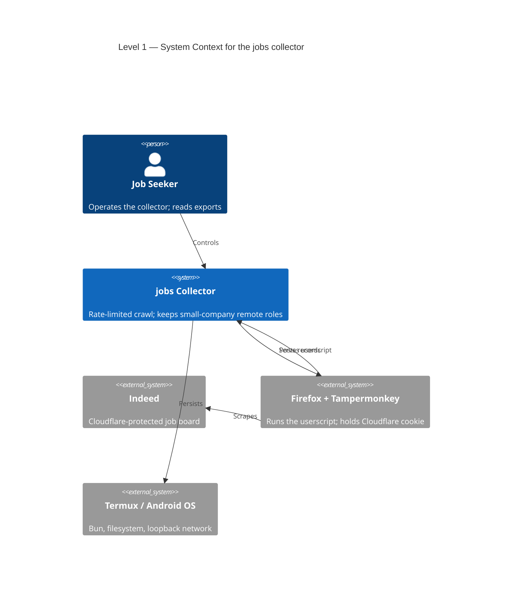
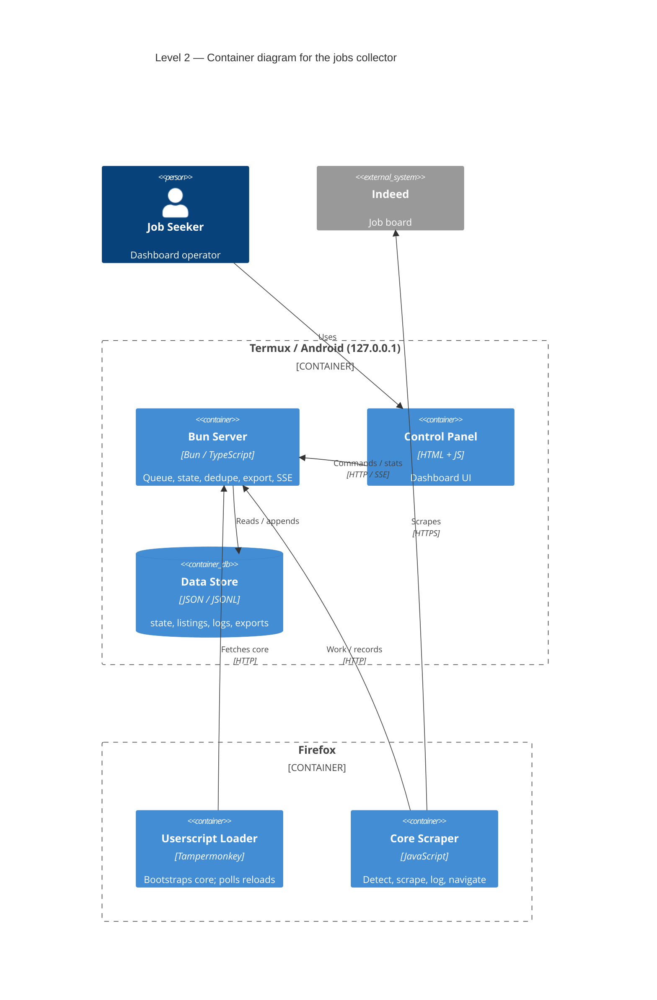
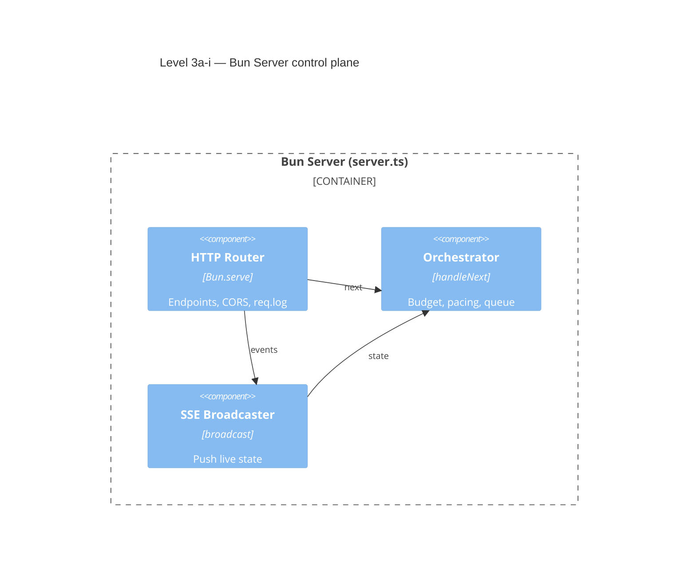
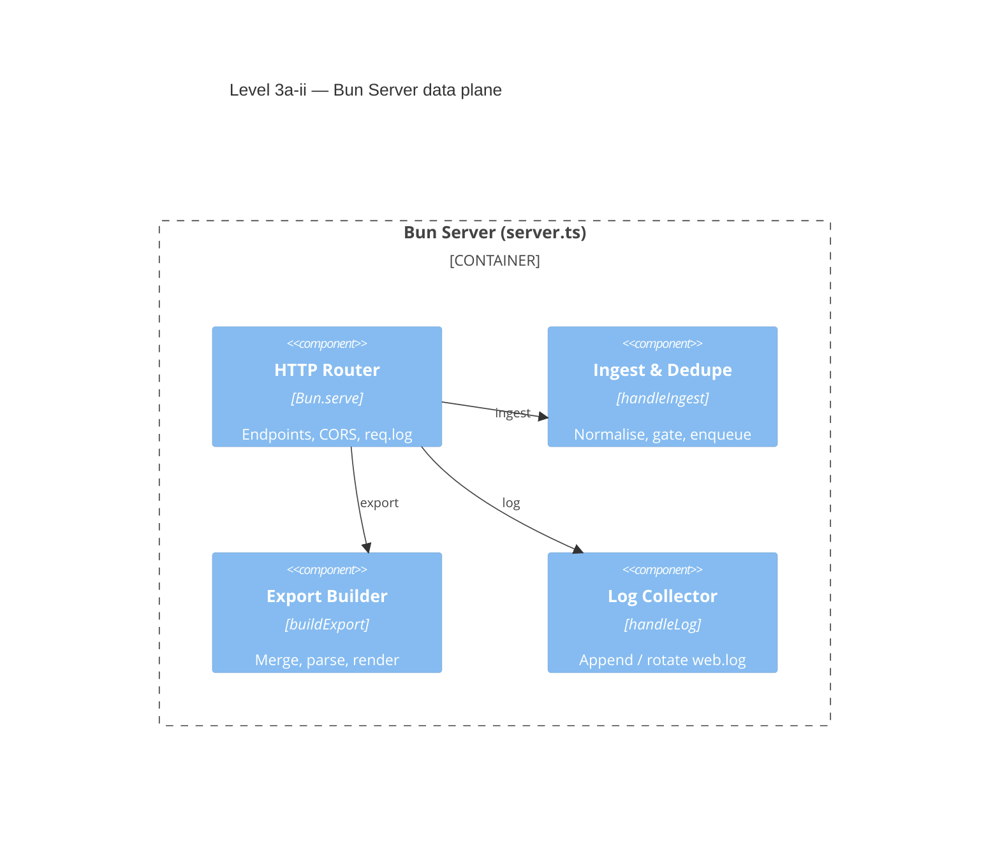
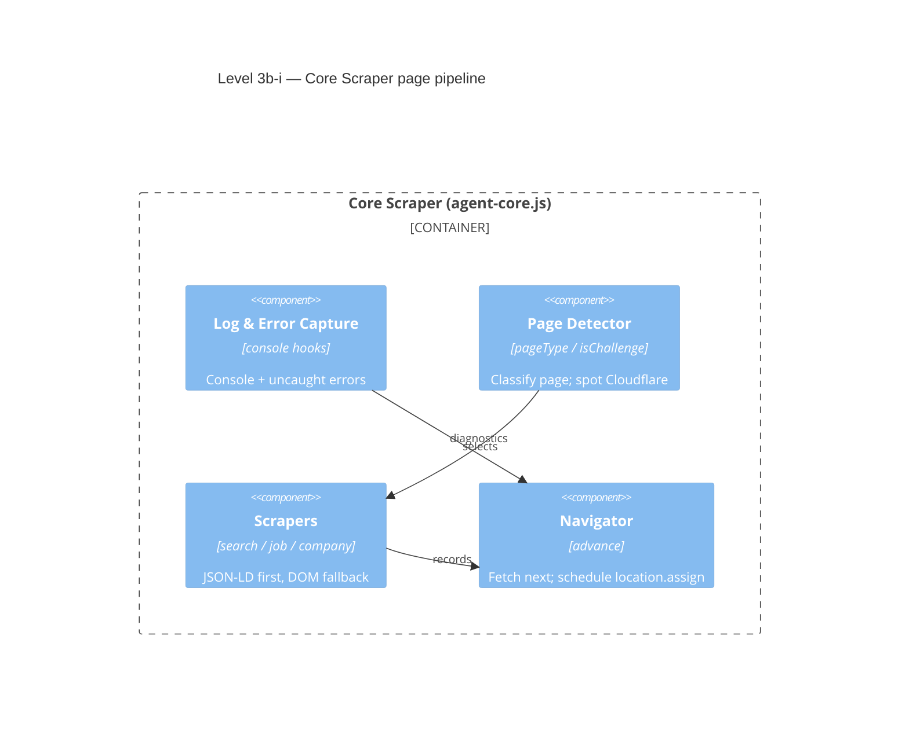
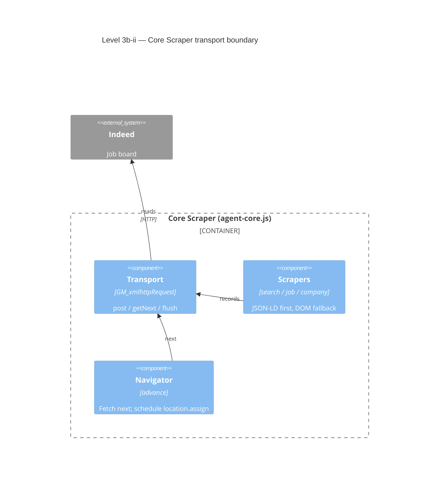
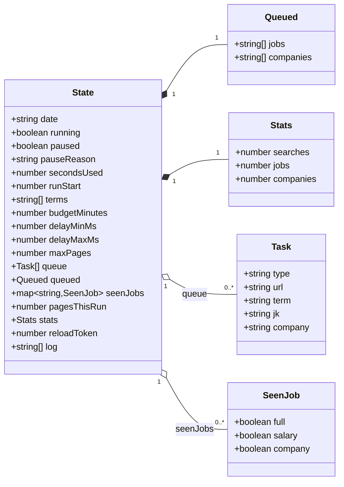
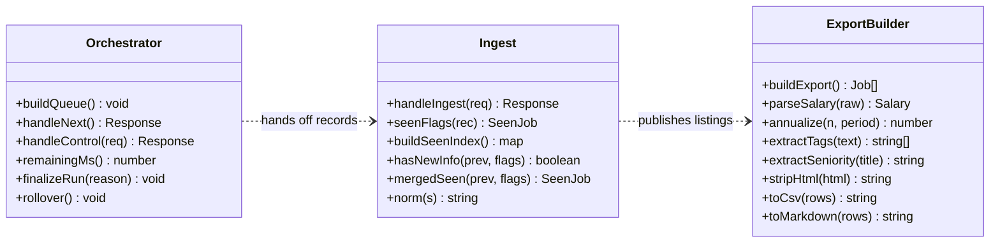
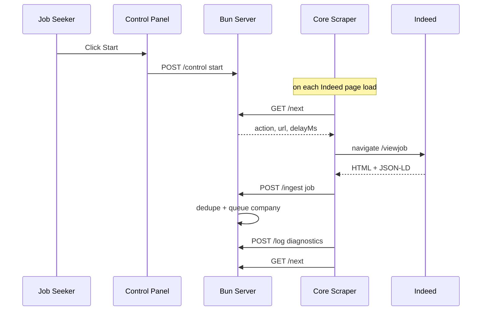
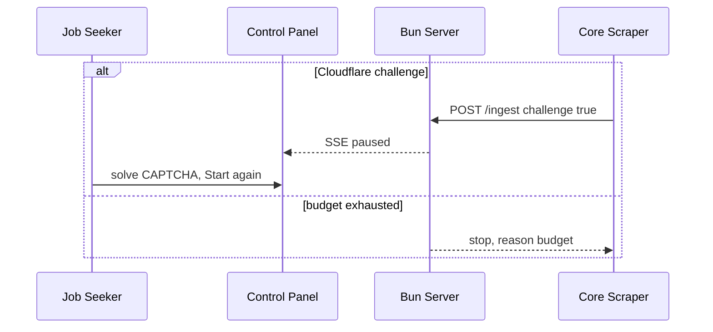

# jobs — Architecture (C4 model)

This document describes the `jobs` collector using the **C4 model**: four
zooming levels of abstraction (Context → Container → Component → Code). Every
diagram is written in Mermaid and is followed by a paragraph explaining why each
element in that diagram matters to the system.

The system in one sentence: a **Tampermonkey userscript running in the user's
Firefox** scrapes remote software jobs from the Cloudflare-protected Indeed
site and posts them to a **Bun server on `127.0.0.1:8000`** in Termux, which
orchestrates the crawl, dedupes and stores the data, and exports resume-ready
files. The unusual split (browser scrapes, server thinks) exists because
Indeed's anti-bot layer blocks every non-browser client and because a
`localhost` page cannot legally read Indeed's HTML.

---

## Level 1 — System Context

The widest view: who uses the system and which external systems it depends on.

- **Job Seeker (person).** The only human actor and the reason the system
  exists: they want a short, high-signal list of remote software roles at small
  companies. They are also the manual fallback when Cloudflare throws a CAPTCHA,
  so their judgment bounds how autonomous the crawl can be.
- **jobs Collector (system under design).** The boundary of everything this
  repo builds. Keeping it a single named system lets us reason about its
  responsibilities (queue, pacing, dedupe, export) without conflating them with
  the browser or the target site.
- **Indeed (external system).** The authoritative data source and the primary
  constraint on the design. Because it is protected by Cloudflare and its terms
  discourage automation, the collector must treat it as hostile and unreachable
  from anything but a real browser.
- **Firefox + Tampermonkey (external system).** The *de facto* scraping engine.
  It is modelled as external because it lives outside the Termux process: the
  userscript executes in the page context, holds the authenticated Cloudflare
  cookie, and is the only component that can read Indeed's DOM and JSON.
- **Termux / Android OS (external system).** The deployment platform. It
  supplies Bun, the JSONL filesystem, the `127.0.0.1` loopback used for the
  browser↔server channel, and the phone's battery/lifecycle which the low daily
  budget is designed to respect.
- **Relationships.** The arrows encode the two hard-won facts of the design:
  the browser must talk to Indeed over real HTTPS (nobody else can), and it must
  talk to the server over loopback (a localhost page could not read Indeed).
  Together they form the only viable topology.

---

## Level 2 — Containers

Zooms into the collector to show the separately deployable/executing pieces and
the data they own.

- **Job Seeker.** Remains the operator: the dashboard gives them the levers
  (Start/Stop/Reset, terms, budget) and the observability (stats, live log) they
  need to keep a deliberately slow, semi-manual crawl on the rails.
- **Bun Server.** The brain. It owns the queue, the daily budget clock, the
  pause/resume state, deduplication, and export generation. Centralising this on
  the server — rather than in the ephemeral page — is what makes the crawl
  resumable and idempotent across navigations and reboots.
- **Control Panel.** The human interface. It is a thin client that renders
  server state over SSE and sends commands over `/control`, so all authority
  stays on the server and the UI can be closed without interrupting a run.
- **Data Store.** The durable memory. Plain JSON/JSONL files were chosen over a
  database because the volume is tiny, the files are directly inspectable from
  Termux, and `listings.jsonl` can be rebuilt into a dedupe index on startup,
  making disk the single source of truth.
- **Userscript Loader.** The stable shim installed once in Tampermonkey. Its
  job is to survive while logic changes underneath it: it fetches the newest
  core with `no-store` on every page load, eval's it with the granted GM
  functions, and polls `/livereload` to force a page reload when code changes.
- **Core Scraper.** The live, frequently edited logic. It runs in the page,
  picks the parser based on page type, ships console output and diagnostics to
  the server, then asks `/next` where to go. Splitting loader from core is what
  makes the debug loop fast: edit a file, reload, no reinstall.
- **Indeed.** Unchanged as the external boundary; every arrow crossing into it
  originates from the core, reinforcing that the browser is the sole extraction
  point.
- **Key relationships.** `core → /next` and `core → /ingest` are the heartbeat of
  the system: a request/response loop where the server hands out exactly one
  action at a time, keeping pacing and budget decisions in one place.

---

## Level 3 — Components

Zooms into the two logical containers (the Bun Server and the Core Scraper) to
show the responsibilities inside each. They are split into two diagrams because
a single combined component diagram crosses the server↔browser boundary many
times, which crowds the relationship labels.

### Level 3a — Bun Server components

Split into a **read/control plane** and a **write/data plane** so no node fans
out to five labelled spokes (the old single diagram stacked five arrows on the
router and merged their labels).

#### Level 3a-i — Server control plane

#### Level 3a-ii — Server data plane

### Level 3b — Core Scraper components

Split so `transport` never receives more than three labelled spokes at once:
one diagram for the **page pipeline**, one for the **transport boundary**.

#### Level 3b-i — Core page pipeline

#### Level 3b-ii — Core transport boundary

**Bun Server components**

- **HTTP Router.** The front door and policy boundary. All endpoint wiring,
  CORS headers, and request logging live here, so the rest of the server is
  pure logic and can be reasoned about without HTTP details.
- **Orchestrator.** The pacing heart of the system. It enforces the daily
  budget, the max-pages cap, pause/resume, and the one-action-at-a-time queue,
  which is precisely what keeps traffic low enough to evade Cloudflare blocks
  and to honour the bounded daily crawl.
- **Ingest & Dedupe.** The data-quality gate. It normalises incoming records,
  decides via `seenJobs` whether a record adds new information
  (description/salary/company), and queues company pages discovered on job
  pages. This prevents `listings.jsonl` from bloating on repeated scrapes.
- **Export Builder.** The value-translation layer. It merges records by `jk`,
  joins jobs to company-size data, flags 1–50-employee companies, parses
  salary/tags/seniority, and renders JSON, Markdown, and CSV — turning raw crawl
  output into resume-ready material.
- **Log Collector.** The observability sink. Because the browser is otherwise a
  black box from Termux, this component normalises and persists all page console
  output and diagnostics, and caps/rotates the log so it stays bounded.
- **SSE Broadcaster.** The live-feedback channel. It pushes state snapshots to
  the dashboard so the operator can watch queue depth, budget burn, and errors
  without polling the filesystem.

**Core Scraper components**

- **Transport.** The tunnel that makes the impossible topology possible:
  `GM_xmlhttpRequest` talks to `127.0.0.1` from an HTTPS page, bypassing CORS,
  mixed-content blocking, and Private Network Access restrictions.
- **Log & Error Capture.** The telemetry source. By wrapping `console` and
  listening for `error`/`unhandledrejection`, it makes failures visible in
  `web.log` even though Firefox DevTools are impractical on the phone.
- **Page Detector.** The dispatcher. It classifies each loaded page as
  search/job/company and performs challenge detection, ensuring the right parser
  runs and that a Cloudflare interstitial halts the crawl instead of corrupting
  data.
- **Scrapers.** The extraction logic and the most fragile part of the system.
  Each parser prefers stable embedded JSON (JSON-LD `JobPosting`, mosaic
  `_initialData`) and falls back to DOM selectors, which is why edits to this
  component are expected and why the loader/core split matters.
- **Navigator.** The loop closer. After every ingest it asks `/next` and
  schedules `location.assign` after the server-provided delay, guaranteeing
  random pacing and a single source of truth for "where next".

---

## Level 4 — Code

The narrowest view: the concrete code structures of the server's domain logic.
Split into two smaller class diagrams — the **state model** (data) and the
**modules** (behaviour) — because one diagram forced long dotted dependency
lines to cross the layout and overlap.

#### Level 4a — State model

#### Level 4b — Server modules

- **State.** The single in-memory source of truth for a run. Modelling it as one
  typed object means the daily budget, queue cursor, terms, pause flag, dedupe
  index, and stats are saved and restored atomically in `state.json`, enabling
  crash-safe resume.
- **Task.** The unit of work in the queue. A discriminated union of
  search/job/company (with `term`/`jk`/`company` labels) is what lets the
  orchestrator emit one generic `/next` response while the core still knows how
  to parse each page.
- **SeenJob.** The compact dedupe fingerprint. Storing only three booleans
  (has full description, has salary, has company) is enough to decide if a new
  scrape adds information, which keeps memory small even after thousands of
  listings.
- **Stats.** The operator-facing counters. They surface crawl productivity
  (searches/jobs/companies) separately from queue mechanics, so the dashboard
  can show whether a run is actually collecting or just spinning.
- **Queued.** The dedupe ledger of which job keys and companies have already
  been enqueued. It prevents the same follow-up task from being added twice when
  it appears across multiple search terms.
- **Orchestrator.** Implements the control plane: `buildQueue` seeds the search
  tasks, `handleNext` applies budget/cap/pause rules and pops one task,
  `handleControl` mutates configuration, and `rollover` resets the daily budget
  at midnight. It is where the "slow and polite by construction" policy is
  actually enforced.
- **Ingest.** Implements the data plane's integrity: `seenFlags` derives the
  fingerprint, `buildSeenIndex` rebuilds it from disk, `hasNewInfo`/`mergedSeen`
  decide what to write, and `norm` canonicalises company names used for
  queue/join keys.
- **ExportBuilder.** Implements the value plane: `buildExport` merges by `jk`
  and joins companies, `parseSalary`/`annualize` normalise compensation,
  `extractTags`/`extractSeniority` enrich for filtering, `stripHtml` cleans
  descriptions, and `toCsv`/`toMarkdown` render the deliverables.
- **Relationships.** The compositions show that `State` owns the queue and
  dedupe maps; the dashed dependencies show that the Orchestrator mutates
  `State`, Ingest reads/writes `SeenJob` and the queue, and Export consumes the
  deduped listings — i.e. control, data, and value flow through the same state
  object.

---

## Runtime view (appendix)

A dynamic complement to the static levels. Split into the **happy path** (one
successful turn of the crawl loop) and the **failure path** (Cloudflare /
budget), so neither sequence crowds six participants with an `alt` block.

#### Happy path — one crawl turn

#### Failure path — challenge and budget

---

## Deployment note

Everything runs on one Android device under Termux. The Bun server binds only
to `127.0.0.1:8000` (never `0.0.0.0`) so the instrumented endpoint is not
exposed to the LAN; the browser reaches it via loopback, and `GM_xmlhttpRequest`
handles the cross-origin/mixed-content details. The daily budget, randomized
4–12 s delays, and max-pages cap are the deployment-level guardrails that keep
the crawl within Cloudflare and Indeed-ToS tolerances.

## C4 diagram index

| Level | Mermaid type | Question it answers |
|-------|--------------|---------------------|
| 1 Context | `C4Context` | Who uses it and what external systems does it touch? |
| 2 Container | `C4Container` | What separately running/deployable pieces make it up? |
| 3 Component | `C4Component` ×4 | What responsibilities live inside each container? (server split into control/data plane; core split into pipeline/transport) |
| 4 Code | `classDiagram` ×2 | Which concrete types/functions implement those responsibilities? (state model + server modules) |
| Runtime | `sequenceDiagram` ×2 | Happy path and failure path of one crawl turn. |
