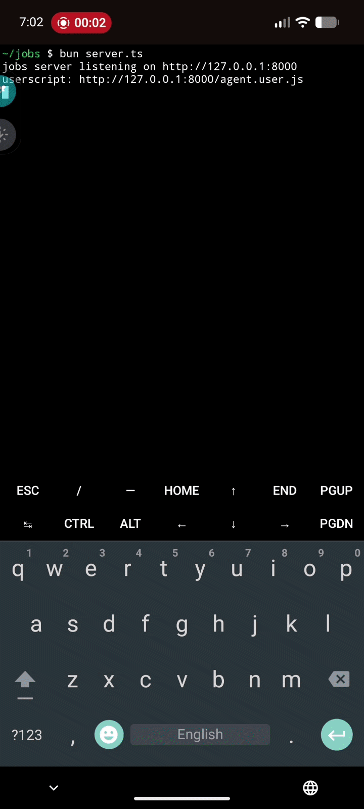
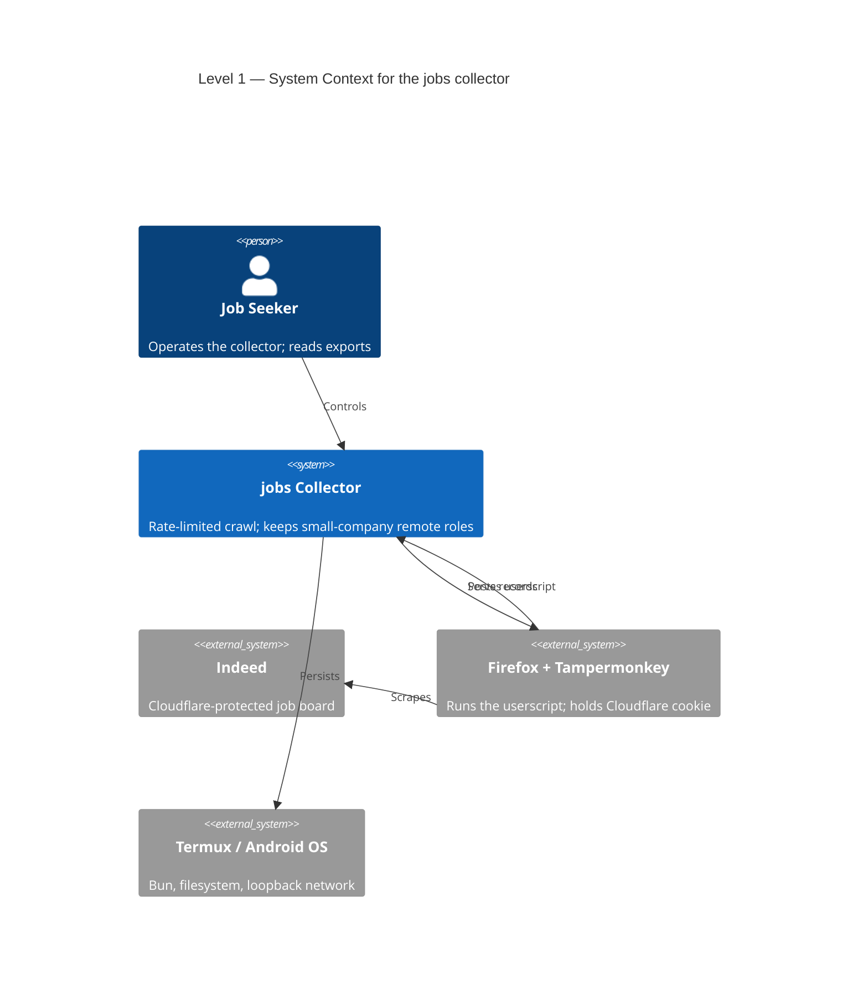

# jobs



## [Architecture](ARCHITECTURE.md)




Collect **remote software job listings** from Indeed and keep them exported as resume-ready data.

Because Indeed sits behind Cloudflare and blocks every non-browser client, the
crawl is split: a **Tampermonkey userscript in Firefox** does the scraping, and
a **Bun server on `127.0.0.1:8000`** (Termux) orchestrates it, stores results,
and renders this dashboard.

## Quick start

```sh
bun server.ts          # http://127.0.0.1:8000
```

1. Open `http://127.0.0.1:8000`.
2. **Install userscript** (top-right) → Tampermonkey prompts.
3. Set terms/budget, then **Start**. Do a dry run with max pages = 1 first.
4. Watch the **Browser log** card and `data/web.log` for diagnostics.
5. Use **Force browser reload** after editing `agent-core.js`.

## Disclaimer

Automating Indeed violates its Terms of Service. This project is for personal,
local use only and runs on a deliberately small daily budget with randomized
delays to limit load and avoid blocks. Use it at your own risk; the author
accepts no liability for how you use it.

## Layout

- `server.ts` — Bun HTTP server, queue/state, dedupe, export builder.
- `public/` — dashboard (`index.html`, `app.js`).
- `agent.user.js` — stable Tampermonkey loader (installed once).
- `agent-core.js` — live scraping/logging logic (edited often).
- `data/` — `state.json`, `listings.jsonl`, `companies.jsonl`, `web.log`,
  `export.{json,md,csv}`.

## Docs

- [ARCHITECTURE.md](ARCHITECTURE.md) — C4 architecture (context → code).
- [AGENTS.md](AGENTS.md) — internals, constraints, and operating notes.
