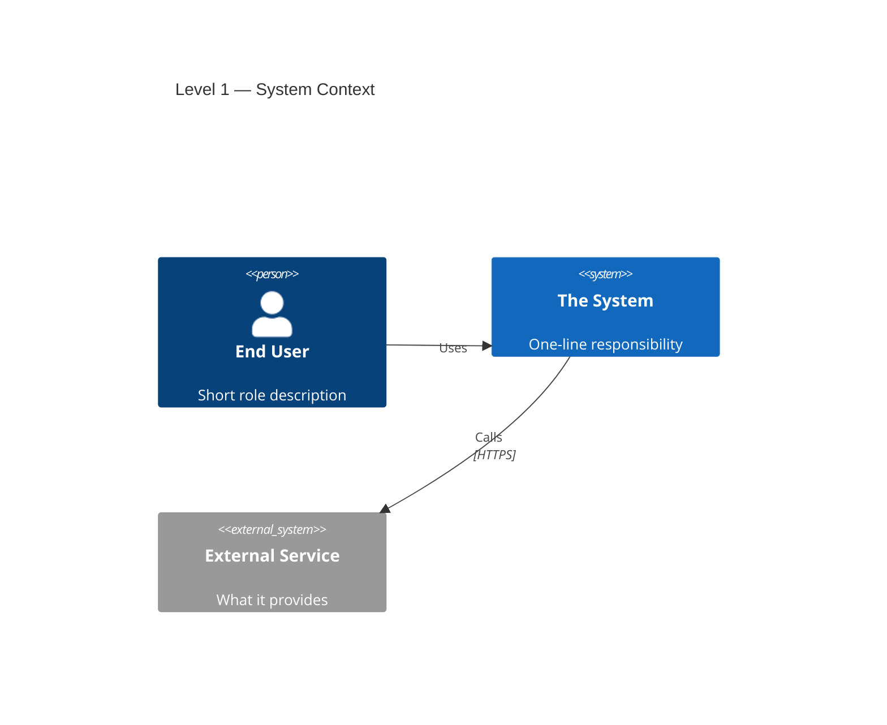
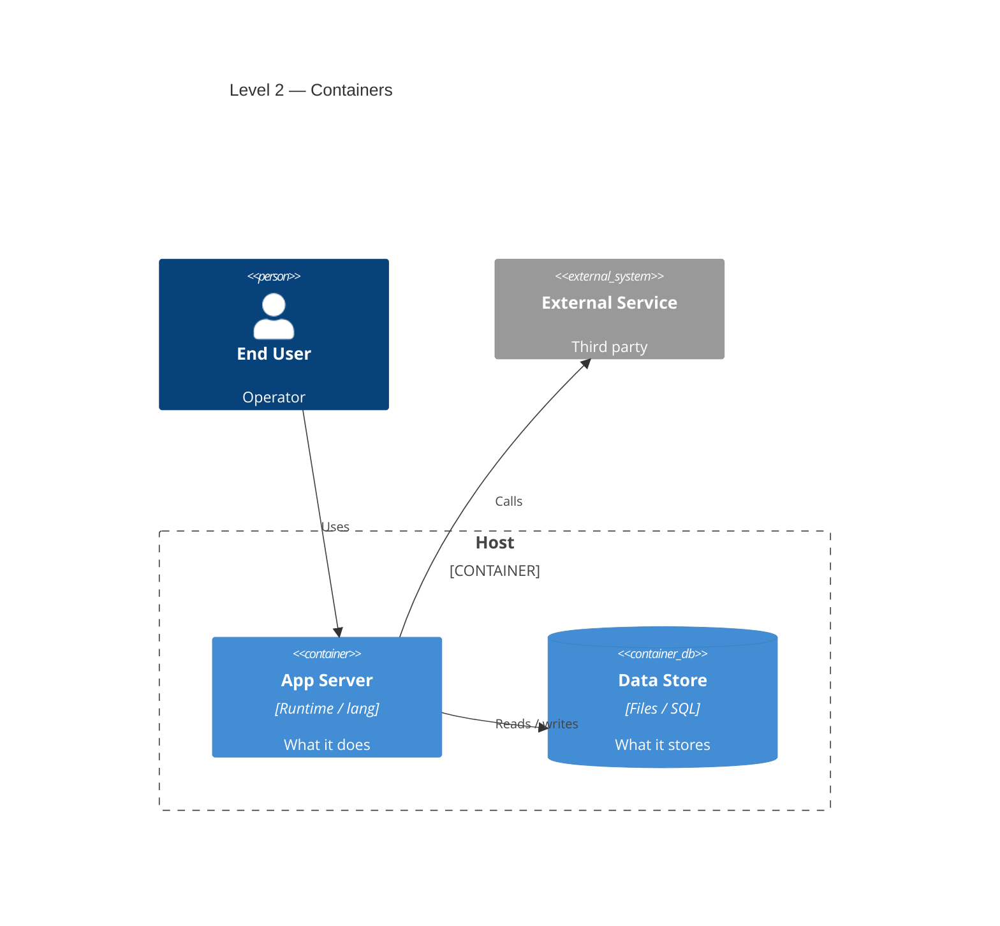
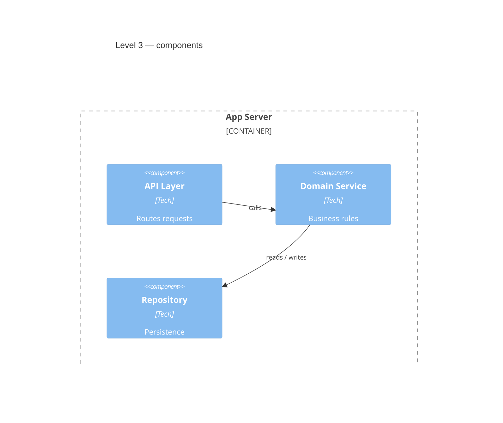
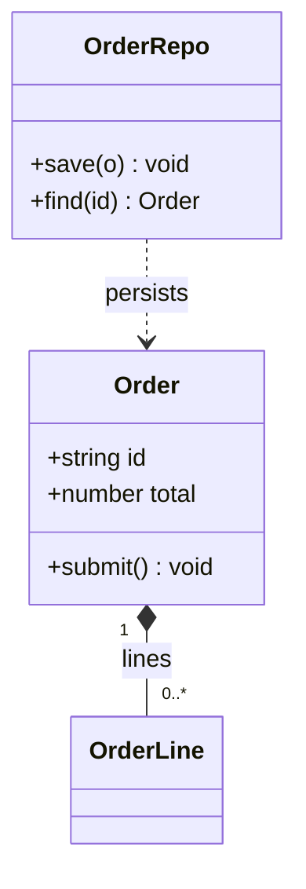
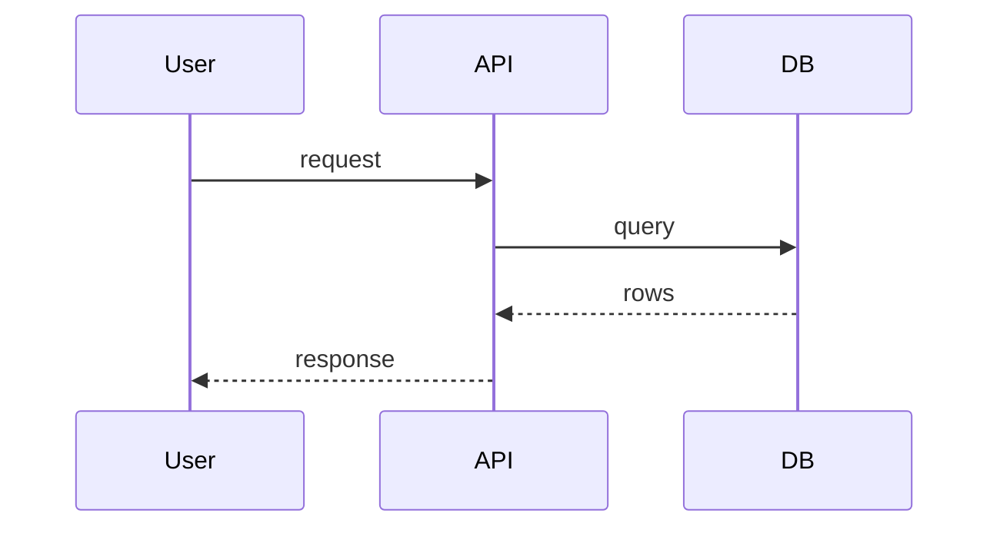

# Runbook — Create `ARCHITECTURE.md` (C4) for any project

**Purpose:** produce a durable `ARCHITECTURE.md` for any repository: a
four-level [C4 model](https://c4model.com/) written as Mermaid diagrams, each
diagram followed by a paragraph per element explaining its importance.

**When to use:** onboarding a codebase, before a big refactor, when handing a
project to another agent/human, or whenever the system's shape is not obvious
from the file tree.

**Output:** `<repo>/ARCHITECTURE.md` (plus, optionally, a docs viewer wired into
the project's existing dashboard).

**Prerequisites:** read access to the repo; `bun` (for the validation script);
a Mermaid v10+ bundle (e.g. `public/mermaid.min.js` or an npm install); `jsdom`
for the parse check; a real browser for the final visual check.

---

## 0. Why C4 (and what "importance paragraphs" means)

C4 gives four zooms so a reader can stop at the level they need:

| Level | Diagram type | Reader's question |
|-------|--------------|-------------------|
| 1 Context | `C4Context` | Who uses it, what external systems does it touch? |
| 2 Container | `C4Container` | What separately running/deployable pieces make it up? |
| 3 Component | `C4Component` | What lives inside each container? |
| 4 Code | `classDiagram` (or ER/sequence) | Which concrete types/functions implement it? |

Every node in a diagram is also named in a following paragraph that answers
*"why does this element exist / why is it important?"*. The diagram is the map;
the paragraphs are the legend. Do not skip them.

---

## 1. Recon — extract the raw material

Walk the repo and fill this inventory. Adapt the commands to the language; the
goal is to find *actors, external systems, processes, stores, endpoints, and key
types*.

| Look for | C4 element |
|----------|-----------|
| Human roles (operator, admin, end user, scheduler) | `Person` |
| Third-party APIs, SaaS, browsers, OS/runtime hosts | `System_Ext` |
| Deployable processes (server, CLI, worker, daemon) | `Container` |
| Databases, files, queues, object stores | `ContainerDb` |
| Browser apps, static bundles, injected scripts | `Container` |
| HTTP handlers, modules, services, workers inside a container | `Component` |
| Key classes/types/schemas and their relationships | Level 4 code |
| A request/job/data lifecycle | Dynamic `sequenceDiagram` |

Useful signals:

```sh
ls -la                                   # top level
find . -maxdepth 2 -name 'package.json' -o -name 'pyproject.toml' \
  -o -name 'Cargo.toml' -o -name 'go.mod' -o -name 'docker-compose*'
grep -rn "listen\|Bun.serve\|app.get\|@app.route\|def main\|func main" \
  --include='*.ts' --include='*.js' --include='*.py' --include='*.go' .
```

Capture: entry points, env/config files, deployment docs, data directories,
scheduled jobs/queues, auth boundaries, and anything the README/AGENTS already
documents (do not contradict it).

---

## 2. Draft the element inventories

Before writing Mermaid, list elements per level as plain text. Keep each level
to **≤ 7–9 nodes**; split if larger.

- **L1:** the system + every `Person` + every external system it talks to.
- **L2:** every deployable/executable unit + every persistent store, grouped by
  runtime boundary (host, cloud, browser).
- **L3:** the important components *inside one container at a time*. If two
  containers are dense, make two diagrams (3a, 3b) — see §5.
- **L4:** the 3–7 types/functions that carry the domain logic, plus their
  relations.

Also list the **relations** (arrows) with a *short* label each. Detail belongs
in the paragraphs, not on the wire.

---

## 3. Write `ARCHITECTURE.md`

Recommended skeleton:

````markdown
# <Project> — Architecture (C4 model)

<One-paragraph summary: what it is, and the single most important design
constraint that shaped it.>

## Level 1 — System Context
```mermaid
C4Context
  ...
```
- **<Element>. ** Why it exists / why it matters.
- **<Relationship>. ** What the arrows encode.

## Level 2 — Containers
```mermaid
C4Container
  ...
```
- **<Element>. ** ...

## Level 3 — Components
### Level 3a — <Container>
```mermaid
C4Component
  ...
```
### Level 3b — <Container>
```mermaid
C4Component
  ...
```
- **<Element>. ** ...

## Level 4 — Code
```mermaid
classDiagram
  ...
```
- **<Element>. ** ...

## Runtime view (appendix)
```mermaid
sequenceDiagram
  ...
```

## Deployment note
<Where it runs, exposure, limits, cost/rate guardrails.>

## C4 diagram index
| Level | Mermaid type | Question it answers |
|-------|--------------|---------------------|
| ... | ... | ... |
````

Write the paragraphs immediately after each diagram, one bullet per node **and**
one for the relationships as a group.

---

## 4. Mermaid templates

### 4.1 C4Context



### 4.2 C4Container



### 4.3 C4Component (one container; split if dense)



### 4.4 Level 4 — class diagram



### 4.5 Runtime — sequence



---

## 5. Readability rules (learned the hard way)

C4 edge labels are placed at wire midpoints, so **long labels on crossing wires
overlap**. Always:

1. **Short labels.** ≤ 3 words. Move detail into the node description or the
   importance paragraphs (e.g. `"GET /next; POST /ingest; POST /log"` → `"Work / records"`).
2. **Spread the layout.** Add `UpdateLayoutConfig($c4ShapeInRow="2",
   $c4BoundaryInRow="1")` inside the diagram, right after `title`.
3. **Split dense Level 3s.** One diagram per container. Crossing the
   container↔external boundary many times is what tangles labels.
4. **No shrinking.** Initialize Mermaid with `useMaxWidth:false` and larger C4
   margins so the SVG keeps natural size; wrap it in a horizontally scrollable
   container. Scaling a wide diagram down to fit a phone makes it unreadable.
5. **Avoid labeled hubs.** A node with 5+ labeled spokes crowds its labels; split
   the diagram or group the spokes.
6. **Keep symbols ≤ 9 per diagram.** If you can't, you're at the wrong level.

Viewer init snippet:

```js
mermaid.initialize({
  startOnLoad: false,
  theme: "dark",
  securityLevel: "loose",
  c4: {
    useMaxWidth: false,
    c4ShapeInRow: 2,
    c4BoundaryInRow: 1,
    c4ShapeMargin: 80,
    diagramMarginX: 60,
    diagramMarginY: 20,
  },
  flowchart: { useMaxWidth: false },
  sequence: { useMaxWidth: false },
  class: { useMaxWidth: false },
});
```

CSS: `.mermaid { overflow-x: auto }` and `.mermaid svg { height: auto }` — do
**not** set `max-width: 100%` on the SVG.

If a single diagram still overlaps after all of the above, add per-edge offsets
for the worst wires and re-check visually:

```mermaid
C4Context
    UpdateRelStyle(from, to, $offsetX="-40", $offsetY="20")
```

---

## 6. Validate the diagrams parse

Save as `validate-mermaid.mjs` and run:

```sh
bun add jsdom            # once, locally
bun validate-mermaid.mjs ARCHITECTURE.md [path/to/mermaid.min.js]
```

```js
// validate-mermaid.mjs — parse-check every mermaid block in a markdown file.
import { readFileSync, existsSync } from "fs";
import { JSDOM } from "jsdom";

const mdPath = process.argv[2];
if (!mdPath) { console.error("usage: bun validate-mermaid.mjs <file.md> [mermaid.min.js]"); process.exit(2); }

const candidates = [
  process.argv[3],
  "public/mermaid.min.js",
  "node_modules/mermaid/dist/mermaid.min.js",
].filter(Boolean);
const mermaidPath = candidates.find((p) => existsSync(p));
if (!mermaidPath) { console.error("mermaid bundle not found; pass it as arg 2"); process.exit(2); }

const dom = new JSDOM("<!doctype html><html><body></body></html>", {
  url: "http://localhost/", pretendToBeVisual: true,
});
const { window } = dom;
for (const k of ["window","document","navigator","location","DOMParser","Node",
  "Element","SVGElement","HTMLElement","Event","CustomEvent"]) globalThis[k] = window[k];
globalThis.window = window;

// mermaid.min.js is a classic script; strip "use strict" and eval it globally.
let src = readFileSync(mermaidPath, "utf8").replace(/^\s*"use strict";/, "");
(0, eval)(src);
globalThis.mermaid.initialize({ startOnLoad: false, securityLevel: "loose", theme: "dark" });

const md = readFileSync(mdPath, "utf8");
const blocks = [...md.matchAll(/```mermaid\n([\s\S]*?)```/g)].map((m) => m[1]);
if (!blocks.length) { console.error("no ```mermaid blocks found"); process.exit(1); }

let bad = 0;
for (let i = 0; i < blocks.length; i++) {
  const first = blocks[i].trim().split("\n")[0];
  try {
    await globalThis.mermaid.parse(blocks[i]);
    console.log(`#${i + 1} OK   (${first})`);
  } catch (e) {
    bad++;
    const msg = String(e?.message ?? e).split("\n")[0];
    console.log(`#${i + 1} FAIL (${first}) -> ${msg}`);
  }
}
console.log(`\n${blocks.length - bad}/${blocks.length} diagrams parse`);
process.exit(bad ? 1 : 0);
```

Notes:

- `mermaid.parse` is a **syntax** check. It is reliable headlessly.
- **Rendering** C4 in `jsdom` fails (`CSSStyleSheet`/SVG `style` gaps) — that is a
  jsdom limitation, not a diagram bug. The class/sequence diagrams usually
  render; C4 does not. Always do the final visual check in a real browser.
- Older Mermaid (< v10) has no C4 diagrams. Upgrade the bundle.

---

## 7. Wire it into a docs viewer (optional)

If the project already has a local dashboard, reuse the `jobs` pattern:

1. **Server endpoints**
   - `GET /docs` → `{ files: [...] }` listing top-level `*.md` (README first).
   - `GET /docs/content?name=<file.md>` → `{ ok, name, html }`, rendering with
     `Bun.markdown.html(src, { tables:true, autolinks:true, strikethrough:true })`.
   - Guard the name: must end in `.md`, must equal its own basename (no `/` or
     `\`), and must be present in the listing.
   - Serve the Mermaid bundle at a fixed route (e.g. `GET /mermaid.min.js`).
   - Serve the dashboard JS with `Cache-Control: no-store` while iterating.
2. **Client**
   - Populate a `<select>` from `/docs`, default to `README.md`.
   - On change, fetch `/docs/content` and set `innerHTML` (fresh fetch, `no-store`).
   - After injecting, replace `pre > code.language-mermaid` with
     `<div class="mermaid">` (using `textContent`) and call
     `mermaid.run({ nodes, suppressErrors: true })`.
   - Lazy-load the Mermaid bundle on first doc open.

If there is no dashboard, stop at `ARCHITECTURE.md` and link it from the README.

---

## 8. Review checklist

- [ ] Four levels present (Context, Container, Component, Code).
- [ ] Every diagram has a one-line title.
- [ ] One importance paragraph/bullet per element, plus one for the relations.
- [ ] Labels ≤ 3 words; detail lives in the paragraphs.
- [ ] `UpdateLayoutConfig` on container/component diagrams.
- [ ] Level 3 split per container when dense.
- [ ] All diagrams **parse** (script exits 0).
- [ ] All diagrams **visually verified** in a browser at phone width; wide ones
      scroll instead of shrinking.
- [ ] Deployment note covers where it runs, exposure, and rate/cost guardrails.
- [ ] C4 index table at the bottom.
- [ ] `README`/`AGENTS` link to `ARCHITECTURE.md`.

---

## 9. Troubleshooting

| Symptom | Cause | Fix |
|---------|-------|-----|
| Edge labels overlap | Long labels on crossing wires | Shorten labels; split the diagram; `UpdateLayoutConfig`; `UpdateRelStyle` offsets |
| Diagram tiny/illegible on phone | `useMaxWidth:true` scaling it down | Set `useMaxWidth:false`, add `overflow-x:auto` on the wrapper |
| `parse` throws on a C4 diagram | Syntax error (typo in `Rel`/name) | Read the error line; names must be declared before use |
| C4 renders blank headlessly | `jsdom` lacks SVG/CSSStyleSheet APIs | Expected; verify in a real browser |
| `UpdateLayoutConfig` ignored | Placed outside the diagram / wrong keyword | Must be inside, after `title`, exact casing |
| Unknown diagram type | Mermaid < v10 | Upgrade bundle |
| Huge unreadable diagram | Too many nodes | Split; one concern per diagram |
| `Bun.markdown` missing | Bun < 1.2 | Upgrade Bun, or render client-side |

---

## 10. Reference implementation

This repository is the worked example: `ARCHITECTURE.md` at the repo root, the
`/docs` + `/docs/content` endpoints in `server.ts`, and the Mermaid viewer in
`public/app.js` / `public/index.html`. Compare against it when unsure about
label style, layout config, or the importance paragraphs.
